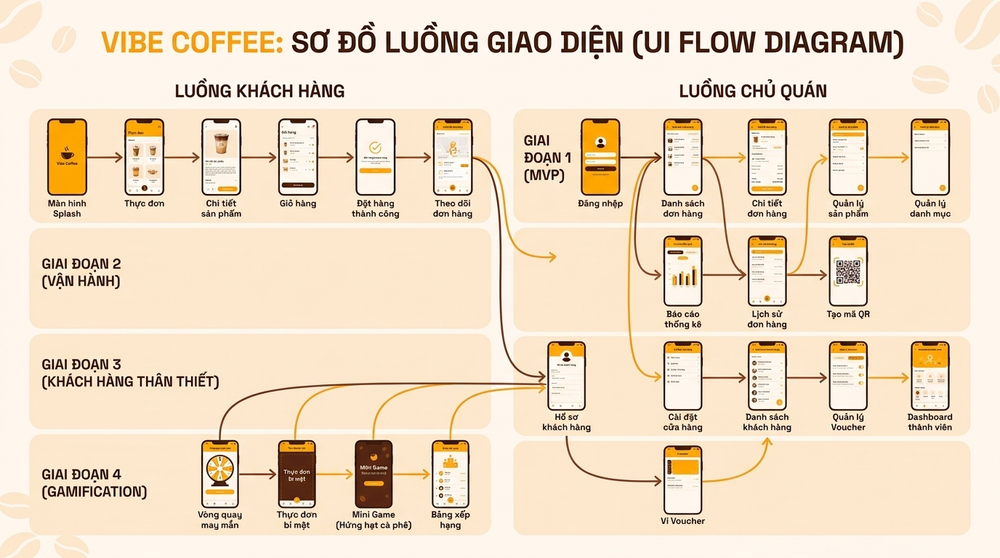

# Vibe Cafe Order

> Hệ thống đặt đồ uống qua QR cho quán cafe take-away — nhanh, đơn giản, không cần app.

---

## Vấn đề thực tế

Giờ cao điểm, khách xếp hàng dài. Bạn vừa pha chế, vừa nhận order miệng, vừa ghi tay — dễ nhầm, dễ quên, dễ mất khách.

**Vibe Cafe Order** giải quyết điều đó bằng 1 tờ giấy dán QR code.

---

## Lợi ích cho chủ quán

**Nhận order không cần rời tay khỏi máy pha**
Khách tự order trên điện thoại. Đơn hàng hiện thẳng lên màn hình của bạn — realtime, không delay, không cần hỏi lại.

**Không bao giờ nhầm order nữa**
Mỗi đơn có đầy đủ: tên người lấy, loại đồ, size, topping, ghi chú. Tất cả rõ ràng trên một card.

**Quản lý menu trong vài giây**
Hết sữa tươi? Tắt món ngay trên điện thoại — menu khách tự cập nhật, không nhận order món đó nữa.

**Biết ngay ai đang chờ gì**
Dashboard chia 3 cột rõ ràng: Đang chờ → Đang làm → Xong. Kéo card, đổi trạng thái, gọi tên khách.

---

## Lợi ích cho khách hàng

**Order trong 30 giây, không cần xếp hàng**
Scan QR → chọn món → gửi. Không cần tải app, không cần tạo tài khoản.

**Biết đồ của mình đang ở đâu**
Sau khi order, khách xem được trạng thái realtime: "Đang pha chế..." → "Đồ xong rồi, lấy tại quầy 🎉"

**Đặt đúng đồ mình muốn**
Chọn size, topping, ghi chú riêng cho từng ly — không lo bị nhầm vì truyền miệng.

---

## UI Flow Diagram



> Luồng khách hàng (trái) và luồng chủ quán (phải) theo từng phase.

---

## Cách hoạt động

```
1. Chủ quán in QR code → dán lên bàn hoặc quầy

2. Khách scan QR bằng camera điện thoại
   → Xem menu → Chọn món → Nhập tên → Gửi order

3. Đơn hàng hiện ngay trên dashboard của chủ quán
   → Beep thông báo → Bắt đầu pha chế → Gọi tên khách

4. Khách xem trạng thái qua link order
   → Nhận thông báo khi đồ xong
```

---

## Tính năng chính

| Tính năng             | Mô tả                                                        |
| --------------------- | ------------------------------------------------------------ |
| 📱 Menu QR            | Khách xem menu, chọn size/topping, gửi order — không cần app |
| ⚡ Realtime Dashboard | Đơn hàng mới hiện ngay, có âm thanh thông báo                |
| 🔍 Order Tracking     | Khách theo dõi trạng thái đơn hàng realtime                  |
| 🎛️ Quản lý menu       | Bật/tắt món, đổi giá, upload ảnh từ điện thoại               |
| 🕐 Ước tính thời gian | Khách biết chờ bao lâu dựa trên queue thực tế                |
| ❌ Tự cancel          | Khách huỷ được đơn trước khi chủ quán bắt đầu pha            |

---

## Bắt đầu nhanh

### Yêu cầu

- [Node.js](https://nodejs.org) 18+
- Tài khoản [Supabase](https://supabase.com) (free)
- Tài khoản [Upstash](https://upstash.com) (free)
- Tài khoản [Vercel](https://vercel.com) (free)

### Cài đặt

```bash
git clone https://github.com/nguyenhoangtin1404/Solo-Cafe-Order.git
cd Solo-Cafe-Order

npm install

cp .env.example .env.local
# Điền Supabase + Upstash keys vào .env.local

npm run dev
# Mở http://localhost:3000
```

Xem hướng dẫn setup chi tiết tại [`docs/SETUP.md`](docs/SETUP.md).

---

## Tech Stack

|               |                                                |
| ------------- | ---------------------------------------------- |
| Frontend      | Next.js · TypeScript · TailwindCSS · shadcn/ui |
| Backend       | Next.js API Routes                             |
| Database      | PostgreSQL (Supabase)                          |
| Realtime      | Supabase Realtime                              |
| Auth          | Supabase Auth                                  |
| Storage       | Supabase Storage                               |
| Rate Limiting | Upstash Redis                                  |
| Deploy        | Vercel                                         |

---

## Roadmap

- **Phase 1** — QR Menu MVP _(đang build)_
- **Phase 2** — Doanh thu, QR in, mobile polish
- **Phase 3** — Loyalty: tích điểm, voucher, order history
- **Phase 4** — Gamification: lucky wheel, secret menu

---

## Tài liệu

| Tài liệu                                             | Mô tả                                                           |
| ---------------------------------------------------- | --------------------------------------------------------------- |
| [`docs/MARKET_RESEARCH.md`](docs/MARKET_RESEARCH.md) | Phân tích thị trường — so sánh 12+ công cụ, cơ hội mở rộng SaaS |
| [`docs/SCREENS.md`](docs/SCREENS.md)                 | Danh sách 28 màn hình theo 4 phases                             |
| [`docs/SETUP.md`](docs/SETUP.md)                     | Hướng dẫn setup chi tiết                                        |
| [`docs/API_CONTRACT.md`](docs/API_CONTRACT.md)       | Đặc tả API endpoints                                            |
| [`docs/DB_SCHEMA.md`](docs/DB_SCHEMA.md)             | Schema database đầy đủ                                          |

---

## License

MIT
