# Vibe Coffee — Danh sách màn hình

> **Tổng cộng: 28 màn hình** · 4 phases + hệ thống  
> Ảnh thiết kế: `docs/design-system/screens/`

---

## Phase 1 — MVP

### Khách (Public)

**1. Menu** — Trang chính: tabs danh mục, grid sản phẩm, search

| v1                                          | v2                                          |
| ------------------------------------------- | ------------------------------------------- |
|  |  |

---

**2. Product Detail Modal** — Chọn size/topping, số lượng, ghi chú

| EN                                                          | VI                                                                |
| ----------------------------------------------------------- | ----------------------------------------------------------------- |
|  | 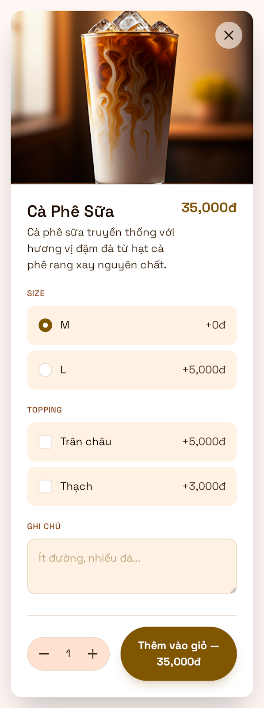 |

---

**3. Cart** — Giỏ hàng: danh sách items, tổng tiền, nhập tên + ghi chú

| Có item                                 | Trống                                               |
| --------------------------------------- | --------------------------------------------------- |
|  |  |

---

**4. Order Success** — Xác nhận đặt thành công: order code, items, thời gian chờ

---

**5. Order Tracking** — Realtime status: code lớn, progress, nút cancel

| Đang pha                                                  | Xong                                                      |
| --------------------------------------------------------- | --------------------------------------------------------- |
|  | 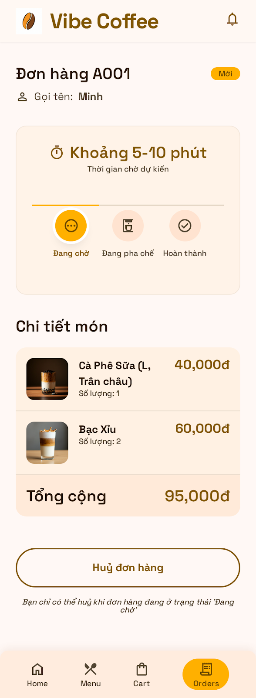 |

> Xem thêm: 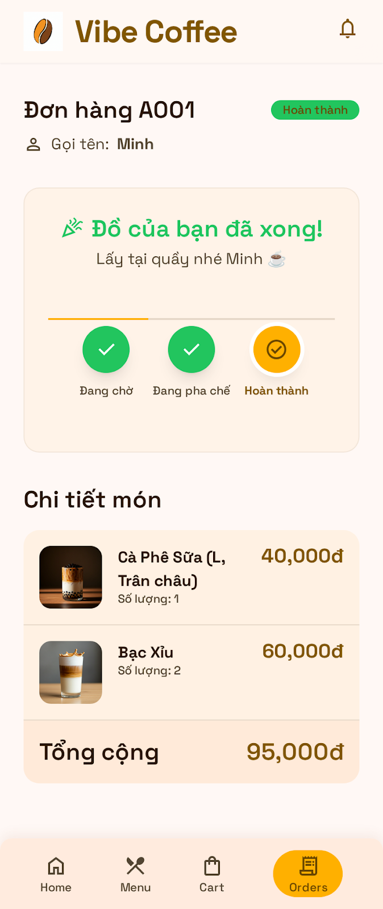

---

### Owner (Auth required)

**6. Login** — Đăng nhập email + password

---

**7. Order Queue** — Realtime dashboard: 3 tabs Mới / Đang pha / Xong, âm thanh thông báo

| Queue                                             | Completed                                                             | No Orders                                                             |
| ------------------------------------------------- | --------------------------------------------------------------------- | --------------------------------------------------------------------- |
|  | 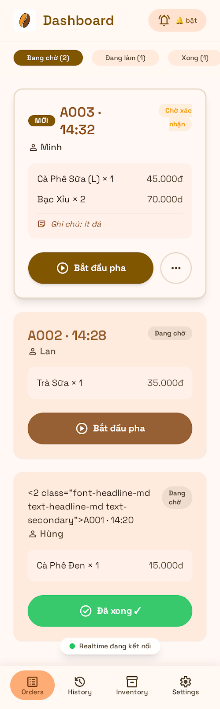 | 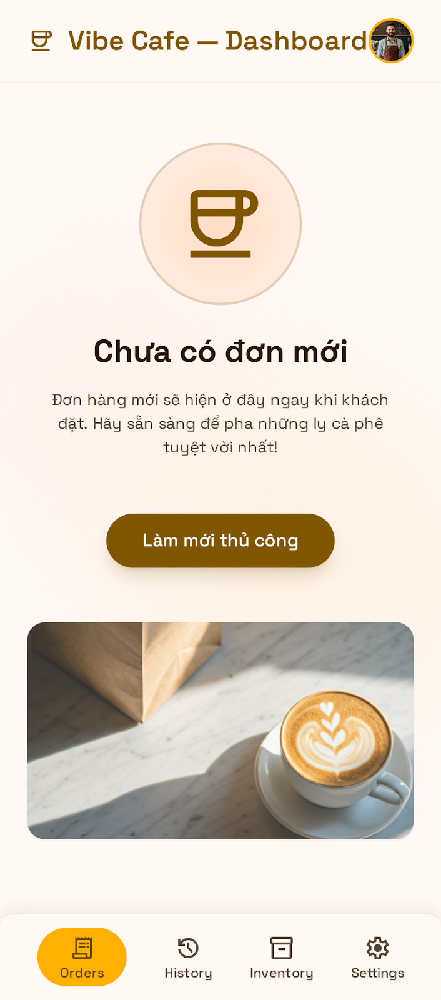 |

| History                                                           | Interactive                                                               |
| ----------------------------------------------------------------- | ------------------------------------------------------------------------- |
| 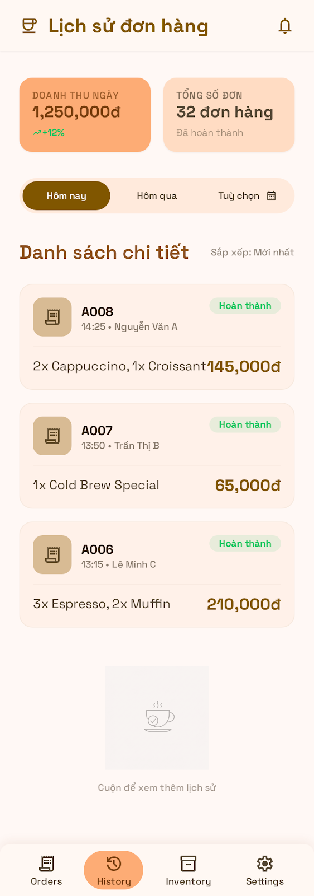 | 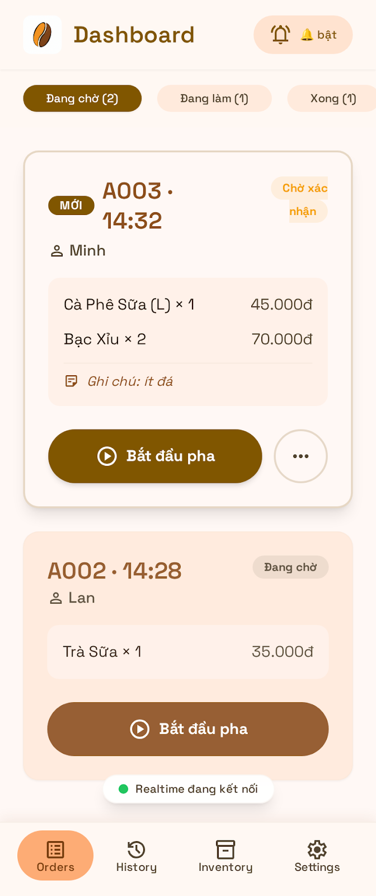 |

---

**8. Order Detail** — Modal/drawer chi tiết đơn: items, ghi chú, action buttons

---

**9. Product List** — Danh sách sản phẩm: toggle available, search, filter

---

**10. Product Form** — Thêm/sửa sản phẩm: ảnh, giá, mô tả, options

---

**11. Category Management** — Thêm/sửa/sắp xếp thứ tự danh mục

| List                                                                  | Form                                                                  |
| --------------------------------------------------------------------- | --------------------------------------------------------------------- |
|  | 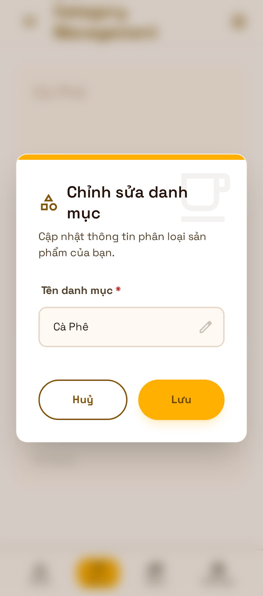 |

---

## Phase 2 — Operations

**12. Revenue Dashboard** — Doanh thu ngày/tuần/tháng, top sản phẩm, biểu đồ

---

**13. Order History** — Lịch sử đơn đã xong: filter theo ngày, tìm kiếm

---

**14. QR Code Generator** — Tạo, preview và in/tải QR cho bàn hoặc takeaway

---

**15. Settings** — Tên quán, giờ mở cửa, thông báo, thời gian pha mặc định

---

## Phase 3 — Loyalty

### Owner

**16. Customer List** — Danh sách khách quen: điểm tích lũy, lịch sử order

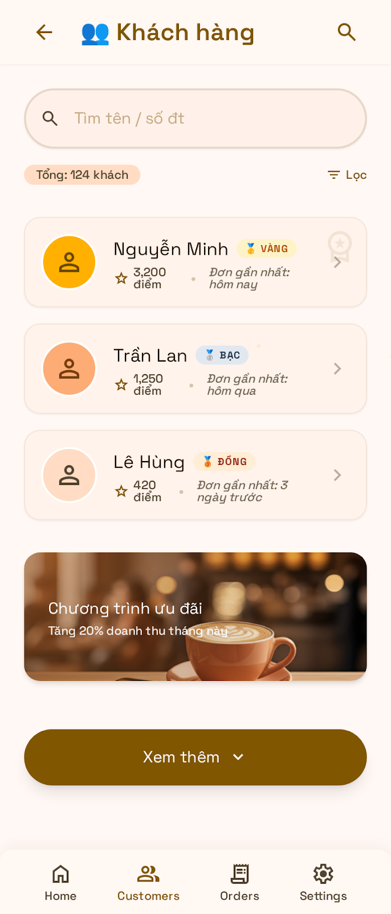

---

**17. Voucher Management** — Tạo/quản lý mã giảm giá, điều kiện áp dụng

| List                                                                | Form                                                    |
| ------------------------------------------------------------------- | ------------------------------------------------------- |
|  | 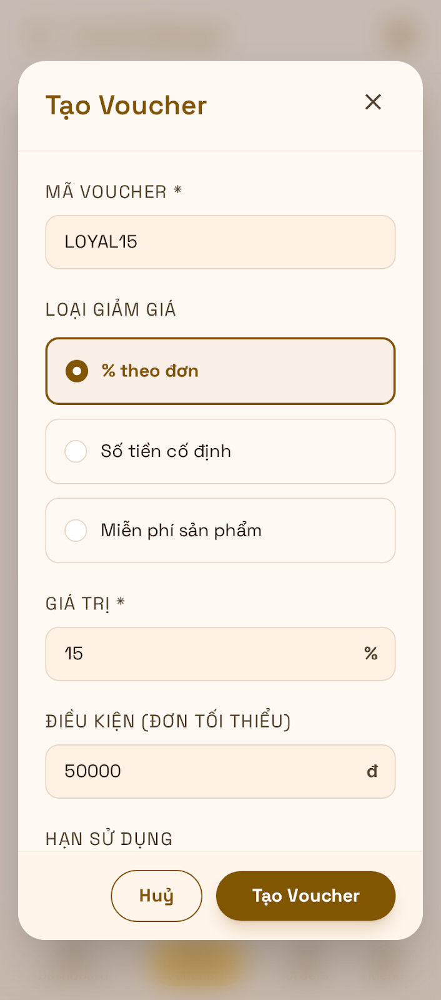 |

---

**18. Loyalty Dashboard** — Thống kê điểm, khách trung thành, tỉ lệ quay lại

---

### Khách

**19. Customer Profile / Loyalty Card** — Điểm tích lũy, lịch sử order, voucher có sẵn

| Card                                                    | History                                                       |
| ------------------------------------------------------- | ------------------------------------------------------------- |
|  | 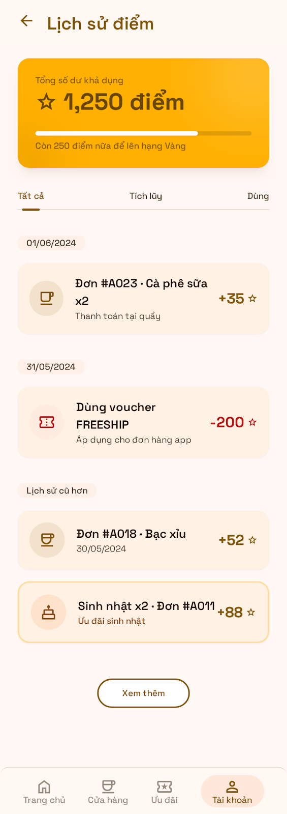 |

---

**20. Voucher Wallet** — Danh sách voucher của khách, trạng thái còn/hết hạn

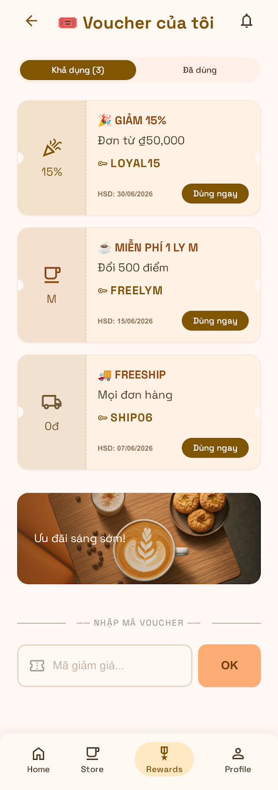

---

## Phase 4 — Gamification

**21. Lucky Wheel** — Vòng quay may mắn sau mỗi order

| Wheel                                                 | Winning                                                     |
| ----------------------------------------------------- | ----------------------------------------------------------- |
|  | 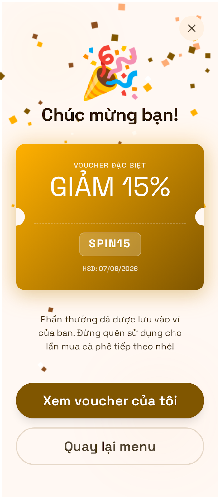 |

---

**22. Secret Menu** — Menu ẩn: unlock khi đủ điểm hoặc có code

| Locked                                                | Unlocked                                                                |
| ----------------------------------------------------- | ----------------------------------------------------------------------- |
|  | 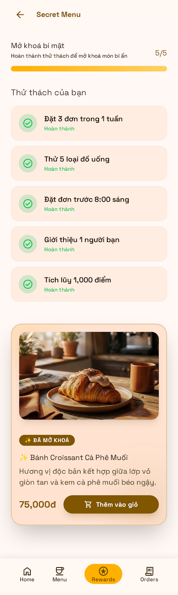 |

---

**23. Mini Game** — Quiz cà phê, đoán hương vị

| Question                                          | Correct Answer                                          |
| ------------------------------------------------- | ------------------------------------------------------- |
|  | 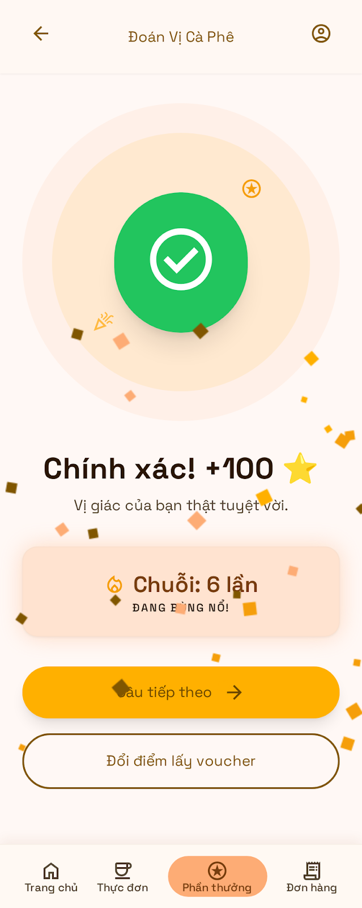 |

---

**24. Leaderboard** — Top khách trong tháng, badge, thành tích

| Game Hub                                        | Leaderboard                                           |
| ----------------------------------------------- | ----------------------------------------------------- |
| 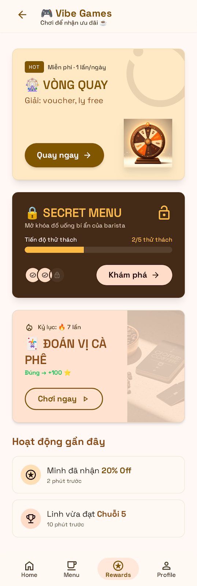 |  |

---

## Hệ thống (xuyên suốt)

**25. 404 / Not Found** — URL sai hoặc order không tồn tại

---

**26. Empty States** — Giỏ trống, menu trống, không có đơn mới

| Cart Empty                                          | Menu Empty                                          |
| --------------------------------------------------- | --------------------------------------------------- |
|  |  |

---

**27. Error / Offline** — Mất mạng, lỗi server

| Network Error                                             | Server Error 500                                        |
| --------------------------------------------------------- | ------------------------------------------------------- |
|  |  |

---

**28. Loading Skeleton** — Placeholder khi đang fetch data

| Menu Skeleton                                             | Dashboard Skeleton                                                  | Loading                                       |
| --------------------------------------------------------- | ------------------------------------------------------------------- | --------------------------------------------- |
|  |  |  |

---

## Realtime Connection States

> Các trạng thái kết nối Supabase Realtime — hiển thị indicator trên từng page.

| Home                                                                          | Menu                                                                          | Cart                                                                          | Dashboard                                                                               | Reconnecting                                                              |
| ----------------------------------------------------------------------------- | ----------------------------------------------------------------------------- | ----------------------------------------------------------------------------- | --------------------------------------------------------------------------------------- | ------------------------------------------------------------------------- |
| 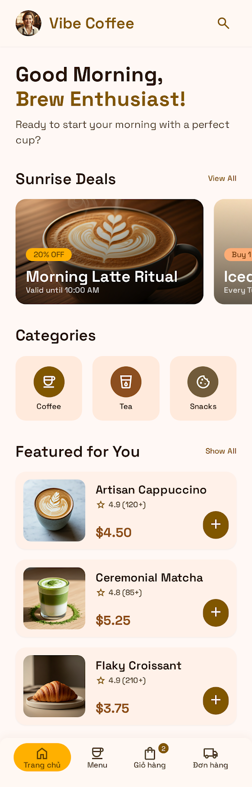 | 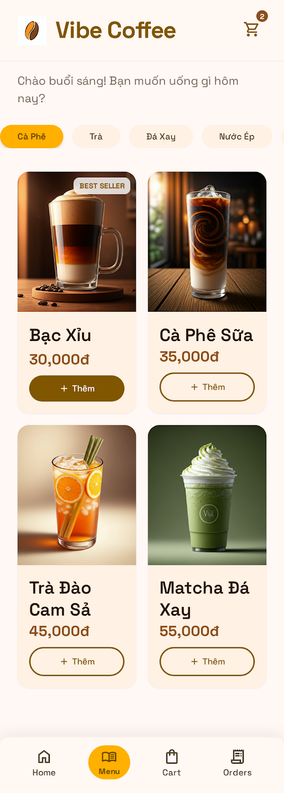 | 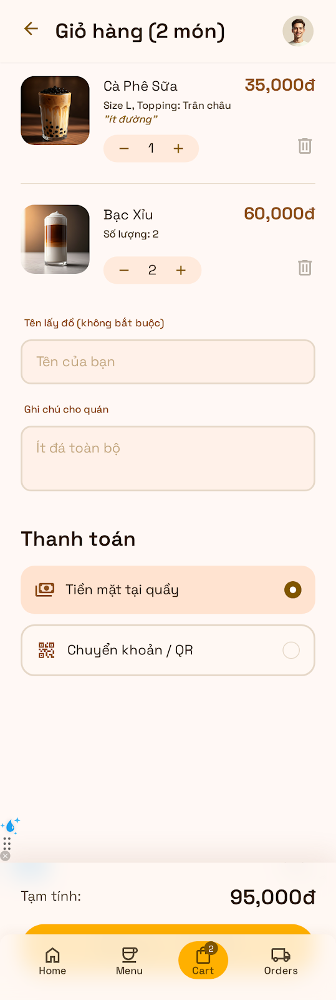 | 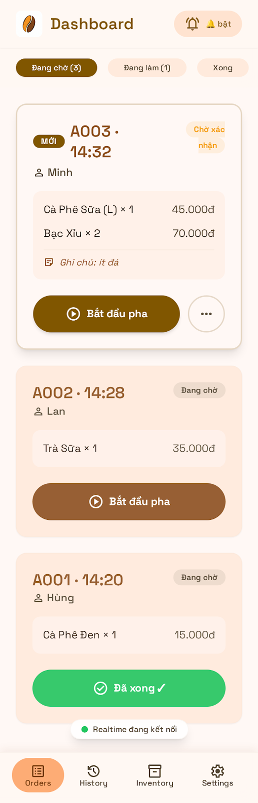 | 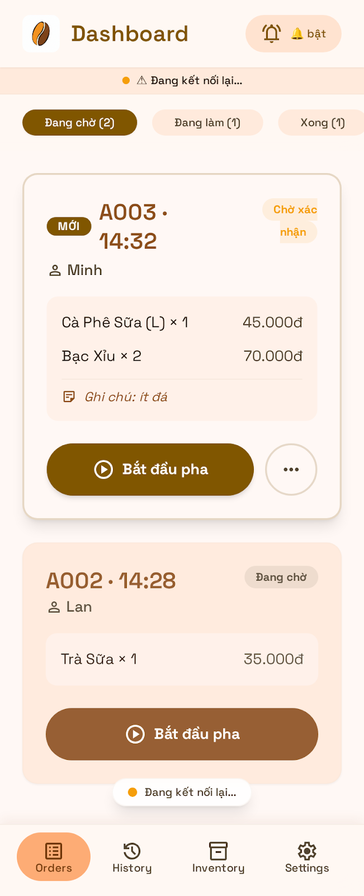 |

---

## Tóm tắt

| Phase                  | Màn hình | Số lượng |
| ---------------------- | -------- | -------- |
| Phase 1 — MVP          | 1 → 11   | 11       |
| Phase 2 — Operations   | 12 → 15  | 4        |
| Phase 3 — Loyalty      | 16 → 20  | 5        |
| Phase 4 — Gamification | 21 → 24  | 4        |
| Hệ thống               | 25 → 28  | 4        |
| **Tổng**               |          | **28**   |

---

_Thiết kế: Sunrise Brew Design System · Xem chi tiết tại [`design-system/DESIGN_LIBRARY.md`](design-system/DESIGN_LIBRARY.md)_
